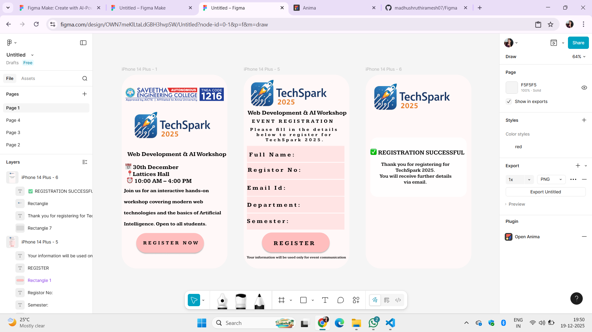

# Ex08 Event Registration Web Application
## Date: 19-12-2025

## AIM:
To design, develop and deploy a web application for event registration using Figma UI tool.

## UI DESIGN TOOL:
Figma

## DESIGN STEPS:

### Step 1:
Use frames to represent screens or sections.

### Step 2:
Add column grids for consistent spacing and alignment.

### Step 3:
Insert shapes, text, buttons, and icons.

### Step 4:
Use Auto Layout for flexible, responsive design.

### Step 5:
Define color, text, and effect styles globally for consistency.

### Step 6:
Name layers logically and group related elements.

### Step 6:
Link frames to show navigation or interactions.

### Step 7:
Select the specific frame while generating code using Anima plugin.

## CODE:


```
registration.html

<!DOCTYPE html>
<html>
  <head>
    <meta name="viewport" content="width=device-width, initial-scale=1" />
    <meta charset="utf-8" />
    <link rel="stylesheet" href="globals.css" />
    <link rel="stylesheet" href="style.css" />
  </head>
  <body>
    <div class="iphone-plus">
      
      <div class="text-wrapper">EVENT REGISTRATION</div>
      <p class="web-development-AI">Web Development &amp; AI Workshop</p>
      <p class="div">Please fill in the details below to register for TechSpark 2025.</p>
      <div class="rectangle-2"></div>
      
      <div class="text-wrapper-2">Full Name:</div>
      
      <div class="text-wrapper-3">Email Id:</div>
      <div class="rectangle-4"></div>
      <div class="text-wrapper-4">Department:</div>
      <div class="rectangle-5"></div>
      <div class="text-wrapper-5">Semester:</div>
      <div class="text-wrapper-6">Registor No:</div>
      <div class="rectangle-6"></div>
      <div class="text-wrapper-7">REGISTER</div>
      <p class="p">Your information will be used only for event communication</p>
    </div>
  </body>
</html>

registration.css
.iphone-plus {
  background-color: #fff8f8;
  overflow: hidden;
  width: 100%;
  min-width: 428px;
  min-height: 787px;
  position: relative;
}

.iphone-plus .rectangle {
  position: absolute;
  top: 0;
  left: 0;
  width: 428px;
  height: 355px;
  aspect-ratio: 1.5;
}

.iphone-plus .text-wrapper {
  position: absolute;
  top: 177px;
  left: 33px;
  height: 24px;
  display: flex;
  align-items: center;
  justify-content: center;
  font-family: "Kameron-Bold", Helvetica;
  font-weight: 700;
  color: #000000;
  font-size: 20px;
  text-align: center;
  letter-spacing: 6.00px;
  line-height: normal;
  white-space: nowrap;
}

.iphone-plus .web-development-AI {
  position: absolute;
  top: 141px;
  left: 16px;
  width: 414px;
  font-family: "Kameron-Bold", Helvetica;
  font-weight: 700;
  color: #000000;
  font-size: 24px;
  letter-spacing: 0;
  line-height: normal;
}

.iphone-plus .div {
  position: absolute;
  top: 189px;
  left: 26px;
  width: 358px;
  height: 110px;
  display: flex;
  align-items: center;
  justify-content: center;
  font-family: "Kameron-Bold", Helvetica;
  font-weight: 700;
  color: #000000;
  font-size: 18px;
  text-align: center;
  letter-spacing: 6.00px;
  line-height: normal;
}

.iphone-plus .rectangle-2 {
  position: absolute;
  top: 358px;
  left: 13px;
  width: 395px;
  height: 65px;
  background-color: #ffe3e3;
}

.iphone-plus .img {
  position: absolute;
  top: 289px;
  left: 13px;
  width: 395px;
  height: 65px;
}

.iphone-plus .text-wrapper-2 {
  position: absolute;
  top: 311px;
  left: -38px;
  width: 303px;
  height: 28px;
  display: flex;
  align-items: flex-end;
  justify-content: center;
  font-family: "Kameron-Bold", Helvetica;
  font-weight: 700;
  color: #000000;
  font-size: 24px;
  text-align: center;
  letter-spacing: 6.00px;
  line-height: normal;
}

.iphone-plus .rectangle-3 {
  position: absolute;
  top: 427px;
  left: 13px;
  width: 395px;
  height: 65px;
}

.iphone-plus .text-wrapper-3 {
  position: absolute;
  top: 446px;
  left: 14px;
  height: 28px;
  display: flex;
  align-items: flex-end;
  justify-content: center;
  font-family: "Kameron-Bold", Helvetica;
  font-weight: 700;
  color: #000000;
  font-size: 24px;
  text-align: center;
  letter-spacing: 6.00px;
  line-height: normal;
  white-space: nowrap;
}

.iphone-plus .rectangle-4 {
  position: absolute;
  top: 495px;
  left: 13px;
  width: 395px;
  height: 65px;
  background-color: #ffe3e3;
}

.iphone-plus .text-wrapper-4 {
  position: absolute;
  top: 515px;
  left: 14px;
  height: 28px;
  display: flex;
  align-items: flex-end;
  justify-content: center;
  font-family: "Kameron-Bold", Helvetica;
  font-weight: 700;
  color: #000000;
  font-size: 24px;
  text-align: center;
  letter-spacing: 6.00px;
  line-height: normal;
  white-space: nowrap;
}

.iphone-plus .rectangle-5 {
  position: absolute;
  top: 564px;
  left: 13px;
  width: 395px;
  height: 65px;
  background-color: #ffe3e3;
}

.iphone-plus .text-wrapper-5 {
  position: absolute;
  top: 581px;
  left: 13px;
  height: 28px;
  display: flex;
  align-items: center;
  justify-content: center;
  font-family: "Kameron-Bold", Helvetica;
  font-weight: 700;
  color: #000000;
  font-size: 24px;
  text-align: center;
  letter-spacing: 6.00px;
  line-height: normal;
  white-space: nowrap;
}

.iphone-plus .text-wrapper-6 {
  position: absolute;
  top: 373px;
  left: 16px;
  height: 28px;
  display: flex;
  align-items: flex-end;
  justify-content: center;
  font-family: "Kameron-Bold", Helvetica;
  font-weight: 700;
  color: #000000;
  font-size: 24px;
  text-align: center;
  letter-spacing: 6.00px;
  line-height: normal;
  white-space: nowrap;
}

.iphone-plus .rectangle-6 {
  position: absolute;
  top: 641px;
  left: 74px;
  width: 274px;
  height: 80px;
  background-color: #ffbebe;
  border-radius: 90px;
  box-shadow: 0px 4px 4px #00000040;
}

.iphone-plus .text-wrapper-7 {
  position: absolute;
  top: 673px;
  left: 121px;
  width: 165px;
  height: 52px;
  display: flex;
  align-items: center;
  justify-content: center;
  font-family: "Kameron-Bold", Helvetica;
  font-weight: 700;
  color: #000000;
  font-size: 24px;
  text-align: center;
  letter-spacing: 6.00px;
  line-height: normal;
}

.iphone-plus .p {
  position: absolute;
  top: 728px;
  left: -117px;
  width: 661px;
  height: 28px;
  display: flex;
  align-items: center;
  justify-content: center;
  font-family: "Kameron-SemiBold", Helvetica;
  font-weight: 600;
  color: #00000033;
  font-size: 14px;
  text-align: center;
  letter-spacing: 0;
  line-height: normal;
}
```
```
index.html
<!DOCTYPE html>
<html>
  <head>
    <meta name="viewport" content="width=device-width, initial-scale=1" />
    <meta charset="utf-8" />
    <link rel="stylesheet" href="globals.css" />
    <link rel="stylesheet" href="style.css" />
  </head>
  <body>
    <div class="iphone-plus">
      
      
      <p class="web-development-AI">Web Development &amp; AI Workshop</p>
      <p class="element-december">
        📅 30th December<br />
        📍Lattices Hall<br />
        ⏰ 10:00 AM – 4:00 PM
      </p>
      <p class="text-wrapper">
        Join us for an interactive hands-on workshop covering modern web technologies and the basics of Artificial
        Intelligence. Open to all students.
      </p>
      <div class="rectangle"></div>
      <div class="div">REGISTER NOW</div>
    </div>
  </body>
</html>

index.css

.iphone-plus {
  background-color: #fff8f8;
  width: 100%;
  min-width: 428px;
  min-height: 787px;
  position: relative;
}

.iphone-plus .logo {
  position: absolute;
  top: 49px;
  left: 9px;
  width: 411px;
  height: 62px;
  aspect-ratio: 6.65;
  object-fit: cover;
}

.iphone-plus .festlogo {
  position: absolute;
  top: 33px;
  left: 0;
  width: 428px;
  height: 452px;
  aspect-ratio: 1.5;
}

.iphone-plus .web-development-AI {
  position: absolute;
  top: 309px;
  left: 23px;
  font-family: "Kameron-Bold", Helvetica;
  font-weight: 700;
  color: #000000;
  font-size: 24px;
  letter-spacing: 0;
  line-height: normal;
  white-space: nowrap;
}

.iphone-plus .element-december {
  position: absolute;
  top: 362px;
  left: 15px;
  font-family: "Kameron-Bold", Helvetica;
  font-weight: 700;
  color: #000000;
  font-size: 24px;
  letter-spacing: 0;
  line-height: normal;
}

.iphone-plus .text-wrapper {
  position: absolute;
  top: 471px;
  left: 9px;
  width: 415px;
  height: 136px;
  display: flex;
  align-items: center;
  justify-content: center;
  font-family: "Kameron-Bold", Helvetica;
  font-weight: 700;
  color: #000000;
  font-size: 20px;
  letter-spacing: 0;
  line-height: 45px;
}

.iphone-plus .rectangle {
  position: absolute;
  top: 643px;
  left: 59px;
  width: 274px;
  height: 80px;
  background-color: #ffbebe;
  border-radius: 90px;
  box-shadow: 0px 4px 4px #00000040;
}

.iphone-plus .div {
  position: absolute;
  top: 671px;
  left: 63px;
  width: 270px;
  height: 24px;
  display: flex;
  align-items: center;
  justify-content: center;
  transform: rotate(-0.11deg);
  font-family: "Kameron-Bold", Helvetica;
  font-weight: 700;
  color: #000000;
  font-size: 20px;
  text-align: center;
  letter-spacing: 6.00px;
  line-height: normal;
}
```


```
successful.htm
<!DOCTYPE html>
<html>
  <head>
    <meta name="viewport" content="width=device-width, initial-scale=1" />
    <meta charset="utf-8" />
    <link rel="stylesheet" href="globals.css" />
    <link rel="stylesheet" href="style.css" />
  </head>
  <body>
    <div class="iphone-plus">
      <div class="rectangle"></div>
      <p class="thank-you-for">
        Thank you for registering for TechSpark 2025.<br />
        You will receive further details via email.
      </p>
      
      <div class="text-wrapper">✅ REGISTRATION SUCCESSFUL</div>
    </div>
  </body>
</html>

successful.css

.iphone-plus {
  background-color: #fff8f8;
  width: 100%;
  min-width: 428px;
  min-height: 787px;
  position: relative;
}

.iphone-plus .rectangle {
  position: absolute;
  top: 255px;
  left: 19px;
  width: 390px;
  height: 241px;
  background-color: #d9d9d9;
  border-radius: 28px;
  mix-blend-mode: screen;
}

.iphone-plus .thank-you-for {
  position: absolute;
  top: 371px;
  left: 42px;
  width: 318px;
  height: 59px;
  display: flex;
  align-items: center;
  justify-content: center;
  font-family: "Kameron-SemiBold", Helvetica;
  font-weight: 600;
  color: #000000;
  font-size: 20px;
  text-align: center;
  letter-spacing: 0;
  line-height: normal;
}

.iphone-plus .img {
  position: absolute;
  top: 0;
  left: 0;
  width: 428px;
  height: 370px;
  aspect-ratio: 1.5;
}

.iphone-plus .text-wrapper {
  position: absolute;
  top: 302px;
  left: 14px;
  width: 391px;
  height: 30px;
  display: flex;
  align-items: center;
  justify-content: center;
  font-family: "Kameron-SemiBold", Helvetica;
  font-weight: 600;
  color: #000000;
  font-size: 25px;
  text-align: center;
  letter-spacing: 0;
  line-height: normal;
}
```


## OUTPUT:




## RESULT:
The program to design, develop and deploy a web application for event registration using Figma UI tool is completed successfully.
